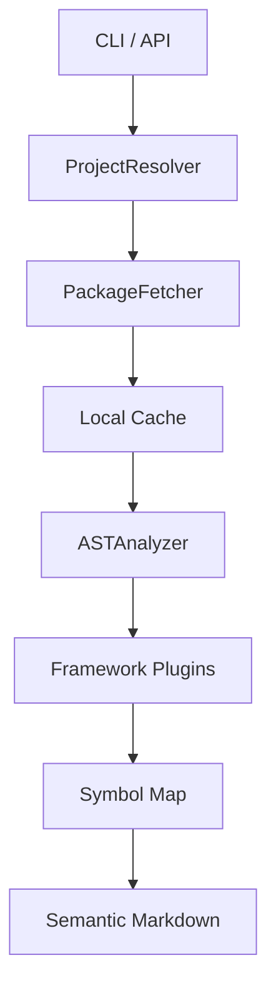

# 📡 agentsrc-py


> **Semantic Signal Extraction for the Age of AI Agents.**

`agentsrc-py` is a powerful, developer-first utility designed to bridge the gap between LLM-based coding agents and the vast ecosystem of Python dependencies. It fetches, unpacks, and analyzes packages to extract high-fidelity semantic summaries, enabling agents to understand complex APIs instantly without reading thousands of lines of source code.

---

## ⚡ Quickstart

Get up and running in seconds:

```bash
# Install with uv (recommended)
uv tool install agentsrc-py

# Initialize a project
agentsrc init

# Sync and analyze your dependencies
agentsrc sync

# Query semantic symbols
agentsrc query search "Pydantic models with validation"
```

## 🛠️ Key Features

- **🎯 Semantic Analysis**: Extracts classes, functions, and docstrings into structured JSON/Markdown.
- **🔌 Plugin System**: Extensible architecture to detect framework-specific patterns (e.g., Pydantic Models).
- **📦 Intelligent Fetching**: Downloads and caches PyPI packages with robust dependency resolution.
- **🔍 Global Symbol Search**: Instantly find any symbol across your entire dependency tree.
- **🚀 Built with uv**: Blazing fast performance and reproducible environments.

## 🏗️ Architecture

The following diagram illustrates how `agentsrc-py` transforms raw PyPI packages into actionable semantic intelligence:



## 🤝 Contributing

We love contributions! Please see [CONTRIBUTING.md](CONTRIBUTING.md) for details on our development workflow and how to get started.

## 📄 License

This project is licensed under the **MIT License** - see the [LICENSE](LICENSE) file for details.

---

<p align="center">
  Built with ❤️ for the AI Developer Community.
</p>
