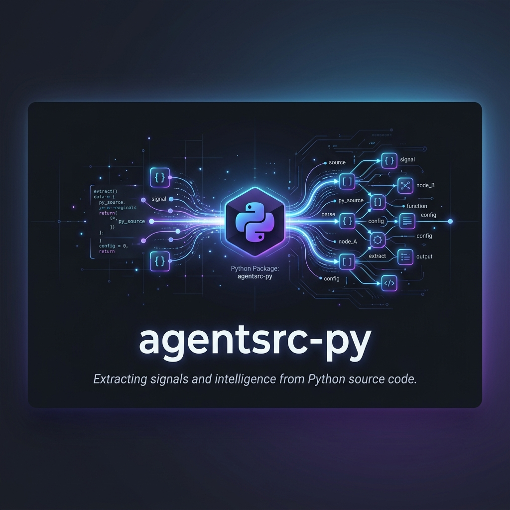
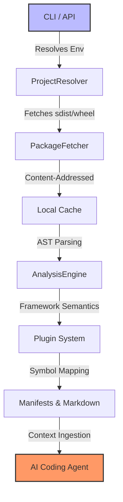

# 📡 agentsrc-py
<p align="center">
  
  
  
  
  
</p>
<p align="center">
  
</p>

<p align="center">
  <b>Semantic Signal Extraction for the Age of AI Agents.</b>
</p>


---

## 👁️ Grounding AI Agents in Reality

Most AI coding agents (Claude, Cursor, etc.) understand Python libraries through outdated training data, static docstrings, or high-level type hints. When they encounter undocumented behavior, internal exception flows, or complex framework patterns (Pydantic, FastAPI), **they hallucinate.**

`agentsrc-py` bridges this gap. It fetches, unpacks, and performs **AST-level analysis** on the exact version of the dependencies you are using, exposing the "ground truth" of the source code directly to your agent.

### ⚖️ Why `agentsrc-py`?

| Feature | Generic RAG / Search | Documentation Sites | `agentsrc-py` |
| :--- | :---: | :---: | :---: |
| **Source of Truth** | Web Crawls (Old) | Docs (High-level) | **Exact Source (Current)** |
| **Version Aware** | Rarely | Partial | **100% (Matches your Env)** |
| **Deep Semantics** | No | No | **Yes (AST Analysis)** |
| **Agent Ready** | Manual ingest | Browser needed | **Native Manifests/Markdown** |

---

## ⚡ 10-Second Quickstart

<p align="center">
  <b>The fastest way to give your agent dependency "superpowers".</b>
</p>

```bash
# 1. Install via uv (recommended) or pip
uv tool install agentsrc-py

# 2. In your project root, initialize and sync
agentsrc init
agentsrc sync

# 3. Watch your agent stop hallucinating.
```

---

## 🛠️ Key Capabilities

- **🎯 Deep AST Analysis**: Extracts classes, functions, and internal decorators into structured JSON/Markdown.
- **🔌 Smart Framework Plugins**: Native understanding of **Pydantic Models**, **FastAPI Routes**, and **SQLAlchemy Relationships**.
- **📦 Version-Locked Fetching**: Automatically resolves and downloads the exact package version from PyPI based on your `uv.lock` or `venv`.
- **🔍 Global Symbol Search**: Instantly find any symbol across your entire dependency tree.
- **🚀 Built with uv**: Blazing fast performance and reproducible environments.

---

## 🏗️ How it Works

The following pipeline illustrates how `agentsrc-py` transforms raw PyPI packages into actionable semantic intelligence:



---

## 🤖 Agent Integration

`agentsrc-py` generates an `instructions.md` (and a universal `AGENTS.md`) at your project root. Simply point your agent to these files:

- **Cursor**: Add `.agentsrc/` to your context.
- **Claude Code**: The agent will automatically find `AGENTS.md`.
- **Roo-Code**: Use the `read_file` tool on `.agentsrc/sources.json`.

---

## 🤝 Contributing & Roadmap

We are currently in **v0.1.0 (Alpha)**. We love contributions, especially new framework plugins!

- [ ] Support for **Poetry** and **Pipenv** lockfiles.
- [ ] **MCP (Model Context Protocol)** Server for real-time querying.
- [ ] Deep transitive dependency analysis.

Please see [CONTRIBUTING.md](CONTRIBUTING.md) and [ROADMAP.md](ROADMAP.md) for more details.

## 📄 License

This project is licensed under the **MIT License** - see the [LICENSE](LICENSE) file for details.

---

<p align="center">
  Built with ❤️ for the AI Developer Community.
</p>
